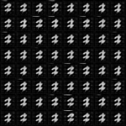
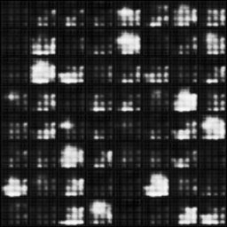
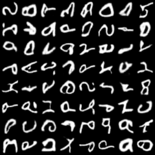
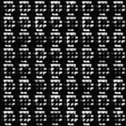

# MNIST

## Training script

```bash
python main.py \
    --GAN DCGAN \
    --dataset ${DATASET_TYPE} \
    --root_dir DATASET \
    --image_size 64 \
    --batch_size 256 \
    --g_lr 0.0002 \
    --d_lr 0.0002 \
    --g_dim 64 \
    --d_dim 64 \
    --image_channels 1 \
    --gpus 1 \
    --max_epochs 20
```

## Result

| MNIST             | Fashion MNIST     |
| ----------------- | ----------------- |
|   |  |
| EMNIST            | KMNIST            |
|  |  |

# CelebA

## Training script

```bash
python main.py \
    --GAN DCGAN \
    --dataset CelebA \
    --transform CelebA \
    --root_dir DATASET \
    --image_size 64 \
    --batch_size 256 \
    --g_lr 0.0002 \
    --d_lr 0.0002 \
    --g_dim 64 \
    --d_dim 64 \
    --image_channels 1 \
    --gpus 1 \
    --max_epochs 80
```

## Result

| CelebA            | CelebA Crop            |
| ----------------- | ---------------------- |
|  |  |
