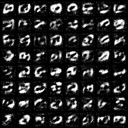

# MNIST

## Training script

```bash
python main.py \
    --GAN GAN \
    --dataset ${DATASET_TYPE} \
    --root_dir DATASET \
    --image_channels 1 \
    --gpus 1 \
    --max_epochs 50
```

## Result

| MNIST             | Fashion MNIST     |
| ----------------- | ----------------- |
|   |  |
| EMNIST            | KMNIST            |
|  |  |
