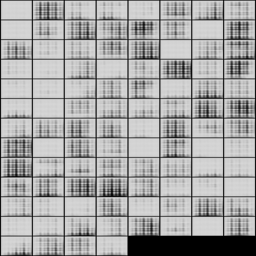

# MNIST

## Training script

```bash
python main.py \
    --GAN WGAN \
    --n_critic 5 \
    --critic_clip_value 0.01 \
    --dataset ${DATASET_TYPE} \
    --transform BASE \
    --root_dir DATASET \
    --image_size 64 \
    --batch_size 256 \
    --g_lr 0.0002 \
    --d_lr 0.0002 \
    --g_dim 64 \
    --d_dim 64 \
    --image_channels 1 \
    --gpus 1 \
    --max_epochs 200
```

## Result

| MNIST             | Fashion MNIST     |
| ----------------- | ----------------- |
|   |  |
| EMNIST            | KMNIST            |
|  |  |

# CelebA

## Training script

```bash
python main.py \
    --GAN WGAN \
    --n_critic 5 \
    --critic_clip_value 0.01 \
    --dataset CelebA \
    --transform CelebA \
    --root_dir DATASET/celeba \
    --image_size 64 \
    --batch_size 256 \
    --sample_count 25 \
    --g_lr 0.0002 \
    --d_lr 0.0002 \
    --g_dim 64 \
    --d_dim 64 \
    --image_channels 3 \
    --gpus 1 \
    --max_epochs 1000
```

## Result

| CelebA            |
| ----------------- |
|  |
